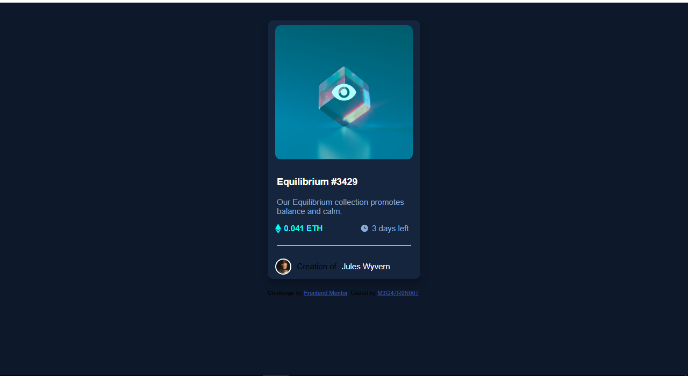

# Frontend Mentor - NFT preview card component solution

This is a solution to the [NFT preview card component challenge on Frontend Mentor](https://www.frontendmentor.io/challenges/nft-preview-card-component-SbdUL_w0U). Frontend Mentor challenges help you improve your coding skills by building realistic projects. 

## Table of contents

- [Overview](#overview)
  - [The challenge](#the-challenge)
  - [Screenshot](#screenshot)
  - [Links](#links)
- [My process](#my-process)
  - [Built with](#built-with)
  - [What I learned](#what-i-learned)
  - [Continued development](#continued-development)
  - [Useful resources](#useful-resources)
- [Author](#author)
- [Acknowledgments](#acknowledgments)

## Overview

### The challenge

Users should be able to:

- View the optimal layout depending on their device's screen size
- See hover states for interactive elements

### Screenshot



### Links

- Solution URL: [Github](https://github.com/Onyekachukwu-Nweke/NFT-CARD)
- Live Site URL: [Replit](https://nft-card.onyekachukwunwe.repl.co/)

## My process

### Built with

- Semantic HTML5 markup
- CSS custom properties
- Flexbox

### What I learned

```html
<h1>Some HTML code I'm proud of</h1>
```
```css
.proud-of-this-css {
  background-image: linear-gradient(hsl(178, 100%, 50%, 0.3), hsl(178, 100%, 50%, 0.3)), url('./images/icon-view.svg') , url('./images/image-equilibrium.jpg');
}
```
### Continued development
I plan to use CSS variables for colors, and also find a better way to center the items

### Useful resources

- [w3schools](https://www.w3schools.com) - This helped me for background image. I really liked this pattern and will use it going forward.
- [CSS tricks](https://www.example.com) - This is an amazing article which helped me finally understand flexbox module. I'd recommend it to anyone still learning this concept.

## Author

- Website - [Onyekachukwu Ejiofor Nweke](https://github.com/Onyekachukwu-Nweke)
- Frontend Mentor - [@Onyekachukwu-Nweke](https://www.frontendmentor.io/profile/Onyekachukwu-Nweke)
- Twitter - [@yourusername](https://www.twitter.com/yourusername)

## Acknowledgments